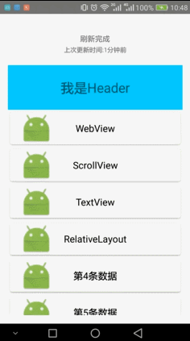
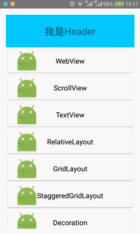

PullRecyclerViewLib
=
### RecyclerView的下拉刷新到底加载的库，基于[SuperRecycleView](https://github.com/supercwn/SuperRecycleView)修改，<br>加载效果使用[AVLoadingIndicatorView](https://github.com/81813780/AVLoadingIndicatorView),特此感谢。
#### 但就我个人而言，更喜欢谷歌的下拉小圆圈，所以我一般使用[ZRecyclerView](https://github.com/zcolin/ZRecyclerView)。ZRecyclerView的接口和PullRecyclerView的接口基本完全一样，可以无缝切换。
  
  
  
Feature
=
1. 制定自定义样式加载Footer请实现ILoadMoreFooter，参照DefLoadMoreFooter.
2. 制定自定义样式下拉Header请实现IRefreshHeader，参照DefRefreshHeader.
3. 可以设置HeaderView、FooterView、emptypView、下拉样式、加载样式等操作.
4. 所有设置在PullRecyclerView中操作，不再在Adapter中进行操作.
5. 支持滑动菜单.

Demo
=




## Gradle
app的build.gradle中添加
```
dependencies {
    compile 'com.github.zcolin:PullRecyclerView:latest.release'
}
```
工程的build.gradle中添加
```
allprojects {
	repositories {
		...
		maven { url 'https://jitpack.io' }
	}
}
```

usage
=

```
//默认已设置LinearLayoutManager
recyclerView.setLinearLayout(false);

//设置刷新和加载更多回调
recyclerView.setOnPullLoadMoreListener(new PullRecyclerView.PullLoadMoreListener() {
    @Override
    public void onRefresh() {
        
    }

    @Override
    public void onLoadMore() {

    }
});

//设置数据为空时的EmptyView，DataObserver是注册在adapter之上的，也就是setAdapter是注册上，notifyDataSetChanged的时候才会生效
recyclerView.setEmptyView(this, R.layout.view_recycler_empty);

//设置HeaderView和footerView
recyclerView.addHeaderView(this, R.layout.view_recyclerheader);
recyclerView.addFooterView(this, R.layout.view_recyclerfooter);
// recyclerView.removeHeaderView(View)

//设置下拉刷新进度条样式
recyclerView.setRefreshProgressStyle(ProgressStyle.LineScaleIndicator);

//设置加载更多进度条样式
recyclerView.setLoadMoreProgressStyle(ProgressStyle.LineScaleIndicator);

//设置Item监听
recyclerView.setOnItemClickListener(new BaseRecyclerAdapter.OnItemClickListener<String>() {
    @Override
    public void onItemClick(View covertView, int position, String data) {
        Toast.makeText(MainActivity.this, data, Toast.LENGTH_SHORT)
             .show();
    }
});

//所有数据加载完毕后，不显示已加载全部
recyclerView.setIsShowNoMore(false);

//到底加载是否可用
recyclerView.setIsLoadMoreEnabled(false);

//下拉刷新是否可用
recyclerView.setIsRefreshEnabled(false);

//设置下拉刷新显示的文字
recyclerView.setRefreshHeaderText("下拉刷新", "释放立即刷新", "正在刷新", "刷新完成");

//有下拉刷新效果，手动调用刷新数据
recyclerView.refreshWithPull();

//没有下拉刷新效果，直接刷新数据
recyclerView.refresh();

//只有下拉刷新效果，不刷新数据
recyclerView.setRefreshing(true);
```


